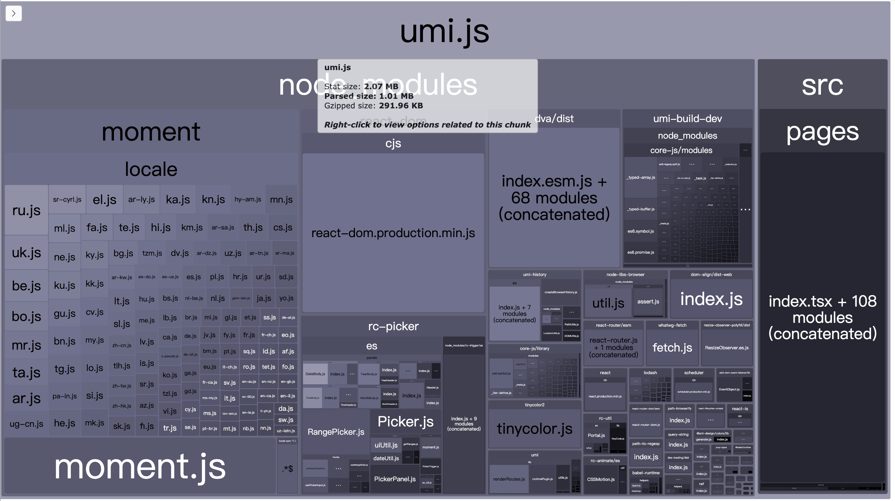
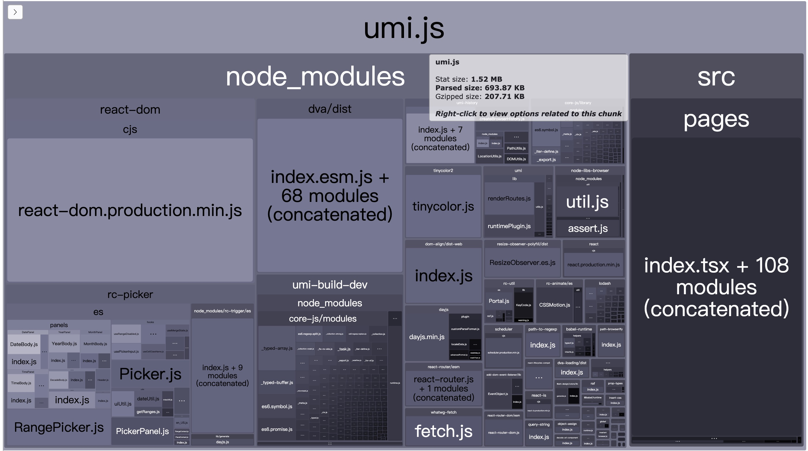

# Antd@4 使用 dayjs 替代 moment

## 组件

### DatePicker

```tsx
import { Dayjs } from 'dayjs';
import dayjsGenerateConfig from 'rc-picker/lib/generate/dayjs';
import generatePicker from 'antd/es/date-picker/generatePicker';
import 'antd/es/date-picker/style/index';

const DatePicker = generatePicker<Dayjs>(dayjsGenerateConfig);

export default DatePicker;

```

### Calendar

```tsx
import { Dayjs } from 'dayjs';
import dayjsGenerateConfig from 'rc-picker/lib/generate/dayjs';
import generateCalendar from 'antd/es/calendar/generateCalendar';
import 'antd/es/calendar/style';

const Calendar = generateCalendar<Dayjs>(dayjsGenerateConfig);

export default Calendar;

```

## 如何使用此 Demo

使用 `src/components` 中的组件替换掉 antd 的 `DatePicker, Calendar`，使用 `<DatePicker picker="time" />` 替代 antd 的`<TimePicker/>`。

```js
import { DatePicker,Calendar } from '@/components';
import format from 'dayjs';
```

替换

```js
import { DatePicker, Calendar } from 'antd';
import format from 'moment';
```

如 `src/pages/index.tsx`

## 有什么好处

使用 `dayjs` 比 `moment` 产物包，小了 `0.55MB` 左右

### moment



### dayjs


